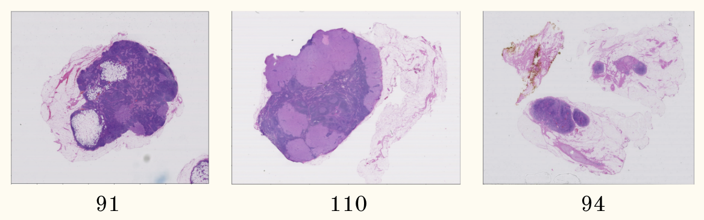
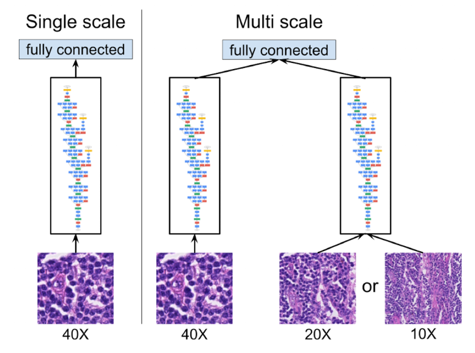
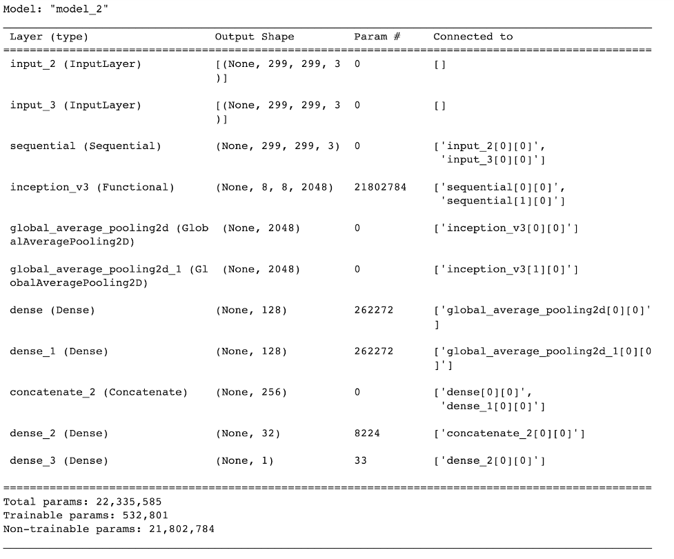
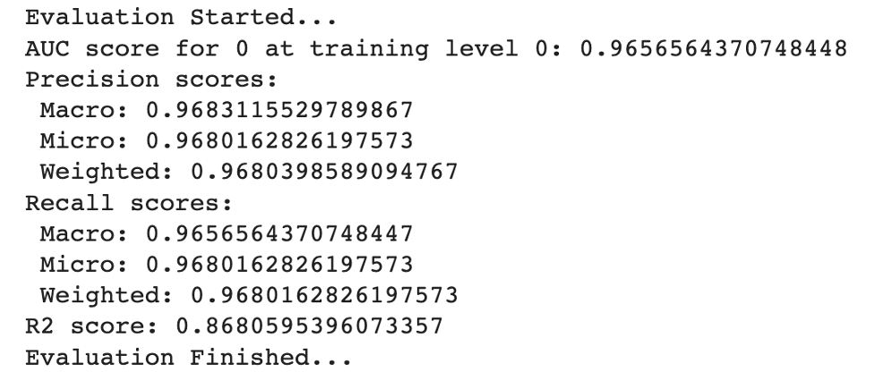
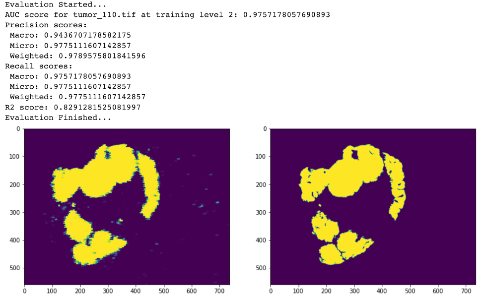
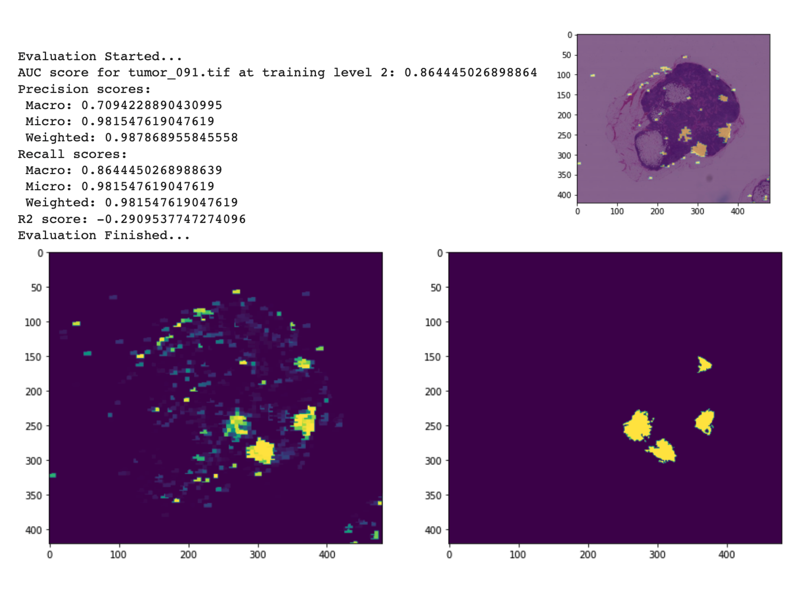
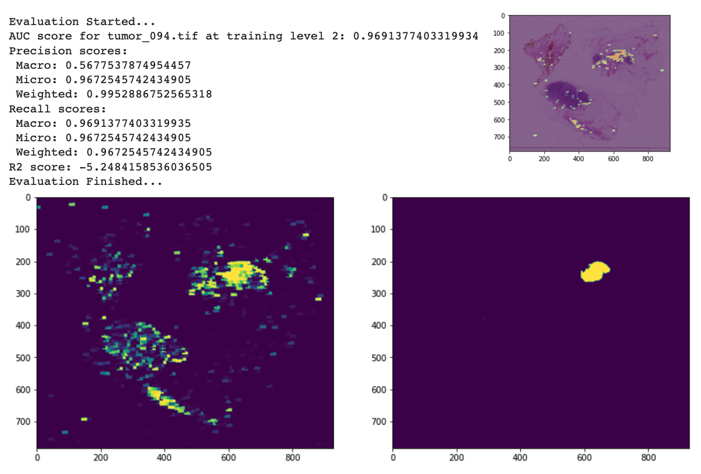
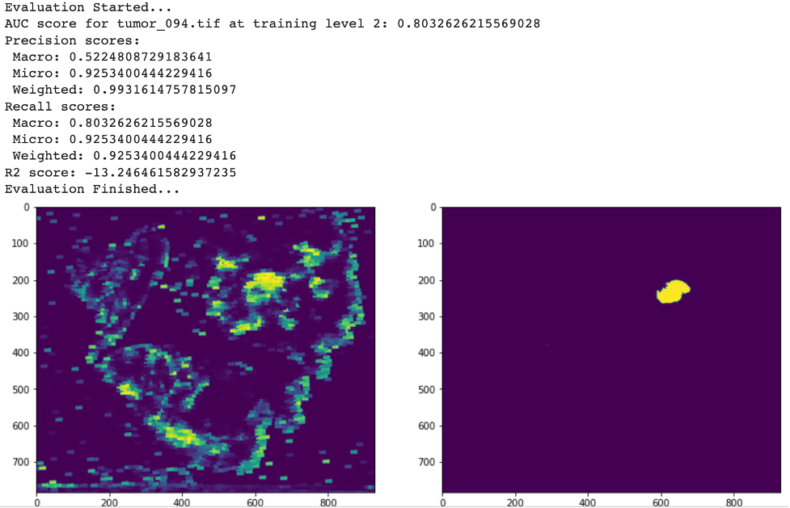
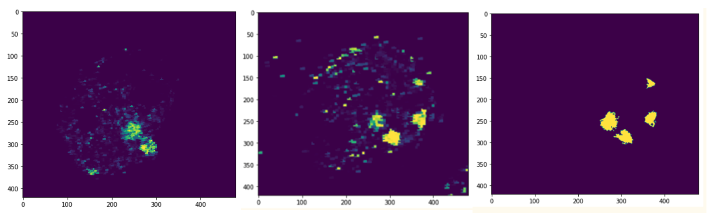

# Cancer Metastasis Detection on Gigapixel Pathology Images
## Table of Contents

- [Objective](#header-1)
- [Key Features](#header-2)
- [Data Preprocessing](#header-3)
- [Implementation Details](#header-4)
- [Model Structure](#header-5)
- [Evaluation Metrics](#header-6)
- [Results](#header-7)
- [Conclusion](#header-8)

## Objective
* Replicate key aspects of the study "Detecting Cancer Metastases on Gigapixel Pathology Images", including data preprocessing, data augmentation, model training, inference, and results generation
* Develop an end-to-end model for predicting cancer metastases from pathology slide images
## Key Features
* Incorporation of multiple slides and zoom levels in the training set
* Tumor image augmentation using flip and rotate techniques
* Use of data augmentation and image normalization
* Comparison of transfer learning and training from scratch using an InceptionV3 model
* Evaluation using various metrics
## Data
* Training and testing using three slides from the CAMELYON16 dataset:
    * : Slides 91 and 110
    * Testing: Slides 91 and 110 (internal), 94 (external)
* Slide 91 contains mostly non-cancerous cells with four small cancerous patches
* Slide 110 contains a large cancerous region
* Slide 94 contains a single cancerous patch and is used for external evaluation of the model

<figure>

<figcaption align = "center"><b>Figure 1: Cell slides at 2 zoom levels included in training set</b></figcaption>
</figure>

## Data Preprocessing
* Random patch extraction of size 128x128 for labels and size 299x299 for patches
* Augmentation of tumor patches from slide 91 using flip and rotate techniques
* Imbalanced data undersampled
* Final training dataset created by loading, decoding, resizing, and normalizing images from (image path 1, image path 2, has tumor) pairs

## Implementation Details
### Zoom level combination:
* Two zoom level combinations used: (3,1) and (2,0)
* Baseline: only zoom level 2 are chosen, model 1 only uses 1 zoom level 
### Data augmentation: 
* Data augmentation layer with brightness (max delta 64/255), saturation (max delta 0.25), hue (max delta 0.04), and contrast (max delta 0.75)

## Model Structure

<figcaption align = "center"><b>Figure 2: Comparison of multi-scale and single-scale model structures</b></figcaption>

The model consists of a single scale InceptionV3 pre-trained on zoom level 2 with only slide 91, and a multi-scale model comprising three InceptionV3 models:

* A pre-trained model on ImageNet at zoom levels (3,1) using slides 91 and 110.
* A model with trainable weights at zoom levels (2,0) using slides 91 and 110.
* A dense layer with a size of 32 and a ReLU activation function, created by concatenating the encoded vectors from the first two models. The final output layer uses a sigmoid activation function.

The optimizer for all models is RMSProp with a momentum of 0.9, decay of 0.9, and epsilon of 1. The starting learning rate is 0.002. The loss function used is BinaryCrossentropy and the model evaluation metric during training is binary accuracy. All model are trained between 10-20 epochs.

<figcaption align = "center"><b>Figure 3: Tensorflow model summary</b></figcaption>

## Evaluation Metrics
* The Scikit-learn library was used to compute testing results for the models.
* Four metrics will be calculated in addition to the binary accuracy produced by Tensorflow:
    * AUC
    * Precision (macro, micro, weighted)
    * Recall (macro, micro, weighted)
    * R2 score
* These metrics all measure slide-level classification accuracy by comparing thresholded model predictions to the ground truth.

## Results
### Model 3:
#### Evaluation on training dataset:

---
#### Evaluation on slide 110 (internal testing):

<figcaption align = "left"><b>Figure 5: Left figure is thresholded prediction, right figure is ground truth tumor image</b></figcaption>

---
#### Evaluation on slide 91 (internal testing):

<figcaption align = "left"><b>Figure 6: Left figure is thresholded prediction, right figure is ground truth tumor image</b></figcaption>

---
#### Evaluation on slide 94 (external testing):

<figcaption align = "left"><b>Figure 7: Left figure is thresholded prediction, right figure is ground truth tumor image</b></figcaption>

---
Model 3, which utilizes a multi-scale, multi-image structure and is trained from scratch, demonstrated superior performance on external testing of slide 94 compared to model 2 (using transfer learning from ImageNet weights):

<figcaption align = "left"><b>Figure 8: Left figure is thresholded prediction, right figure is ground truth tumor image</b></figcaption>

---
Model 1 vs Model 3:

<figcaption align = "left"><b>Figure 9: prediction on slide 91 using model 1; prediction on slide 91 using model 3; ground truth of slide 91 </b></figcaption>

## Conclusion
* Model 1, which used the least amount of data with only 1 zoom level (2), performed the worst with AUC only ~52
* Model 2, which has lower zoom level combination (3 & 1), has higher AUC than model 1 on internal testing set: 75 on slide 110 and 60 on slide 91
    * AUC of 52 on external testing set, slide 94
* Model 3, which has higher zoom level combination (2&0) and trainable weights, has highest AUC for both internal and external testing set
    * Slide 110: AUC 94
    * Slide 91: AUC 71
    * Slide 94: AUC 57
* The same pattern can also be observed in precision and recall
* We can conclude that higher zoom level, more training data, and non-transfer learning model helps with improving model performance
